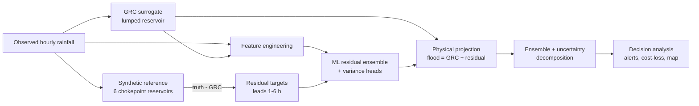

# A Hybrid Physics–Machine-Learning System for Short-Lead Urban Flood Nowcasting: Methodology, Results and Discussion

**Case study: South C, Nairobi (rain gauge TA00026)**

---

## Abstract

Urban pluvial (rainfall-driven) flooding in rapidly growing African cities is
frequent, highly localised and poorly served by conventional hydrological
warning systems. This report presents **FloodCast**, a prototype hybrid
forecasting system that combines a lumped physically-based runoff–capacity
model (the *Generalized Runoff Capacity*, GRC, surrogate) with an
uncertainty-aware machine-learning (ML) residual learner to produce
probabilistic 1–6 hour flood nowcasts for the South C area of Nairobi. Because
no observed inundation record exists for the study area, model skill is
demonstrated against a physically-based **synthetic reference** ("reality")
driven by the real observed rainfall. On a chronologically held-out test set,
the hybrid model reduces the 1-hour flood-depth root-mean-square error (RMSE)
from 2.19 mm (physics only) to **0.73 mm** — a **67 %** reduction — achieves a
flood-event discrimination score of **AUC = 0.871** and a well-calibrated 90 %
predictive interval (empirical coverage 0.888). A cost–loss decision analysis
shows the forecast delivers positive economic value over climatology at short
lead times (best relative economic value **0.582** at 1 h). The results
establish the *method* — not validated operational skill — and provide a
template for deployment once real inundation observations become available.

---

## 1. Introduction

### 1.1 Problem context

Nairobi's South C neighbourhood experiences recurrent flash flooding during the
March–May long rains and October–December short rains. Flooding is driven by
short, intense convective rainfall bursts interacting with undersized and
frequently blocked drainage infrastructure, producing **localised** ponding at a
small number of hydraulic *chokepoints* (culverts, outfalls, low-lying
junctions). Two properties make this problem difficult for classical methods:

1. **Rarity and class imbalance.** Damaging flooding occupies a tiny fraction of
   the record (here a base rate of **0.32 %** of hours), so naïve models are
   biased toward "no flood".
2. **Spatial heterogeneity.** Flood response varies sharply between chokepoints,
   which a single lumped conceptual model cannot represent.

### 1.2 Rationale for a hybrid approach

Purely physical (conceptual/hydrodynamic) models encode mass balance and
capacity constraints but are structurally too simple (when lumped) or too
data-hungry and slow (when fully distributed) for real-time neighbourhood
nowcasting. Purely data-driven models can capture complex nonlinear patterns but
ignore physical constraints, extrapolate poorly and are opaque. We therefore
adopt a **residual (delta) learning** design: a fast physical surrogate provides
a physically-consistent first guess, and an ML model learns the *systematic
residual* between that surrogate and reality, while also quantifying predictive
uncertainty. This preserves physical plausibility, concentrates the learning
problem on what the physics misses, and yields calibrated probabilities suitable
for risk-based decision-making.

### 1.3 Objectives

- Develop a reproducible pipeline that forecasts flood depth and flood
  probability at lead times of **1–6 hours**.
- Quantify **predictive uncertainty** and decompose it into interpretable
  components (aleatory vs epistemic).
- Evaluate not only statistical skill but **decision value** through a cost–loss
  framework.
- Deliver the results through an operational-style **dashboard** (alerts,
  spatial risk map, printable bulletin).

---

## 2. Data

| Source | Variable | Resolution | Role |
|---|---|---|---|
| Gauge **TA00026** | Precipitation | Hourly | Primary model forcing |
| **CHIRPS** satellite | Precipitation | Daily | Slow-varying regional-wetness context |
| MAF station metadata | — | — | Station reference |

The cleaned hourly gauge series spans **88,080 hours (~10.1 years)**, with
**8,368.5 mm** of total rainfall over **12,191 wet hours** and a peak intensity
of **112.3 mm h⁻¹**. Data preparation (module `src/data.py`) enforces a
continuous, gap-free hourly index (missing hours set to zero rainfall and
clipped to be non-negative), and repairs corrupted day-of-year–style dates in
the CHIRPS spreadsheet (e.g. `2026-05-149`) by reconstructing the calendar date
from the stated year and day-of-year. CHIRPS daily totals are broadcast to each
hour of the corresponding day and used **only** as a low-frequency wetness
context feature, never as the sub-hourly signal.

---

## 3. Methodology

The pipeline has five stages: (i) a synthetic physically-based reference; (ii) a
GRC physical surrogate; (iii) feature engineering; (iv) an uncertainty-aware ML
residual learner; and (v) ensemble forecasting with decision analysis.

### 3.1 Synthetic reference ("reality")

In the absence of observed inundation data, a heterogeneous **synthetic truth**
is generated from the real rainfall (`src/synthetic.py`). The catchment is
represented as **six** sub-catchment storage–overflow reservoirs
("chokepoints"), each with independently sampled parameters: runoff coefficient,
infiltration loss, conveyance (pipe) capacity, storage capacity and a
travel-time lag. For each sub-catchment $j$ the effective runoff includes a mild
nonlinear intensity boost,

$$
e_{j,t} = \max\!\big(c_{r,j}\,R^{\,\text{lag}}_{j,t}\,(1 + 0.02\,R^{\,\text{lag}}_{j,t}) - f_j,\; 0\big),
$$

and the reservoir evolves with capacity-limited conveyance, with surface
flooding equal to the overflow above storage capacity $S_{\text{cap},j}$:

$$
S_{j,t} = S_{j,t-1} + e_{j,t} - \min(C_j, S_{j,t-1}+e_{j,t}), \qquad
d_{j,t} = \max(0,\; S_{j,t} - S_{\text{cap},j}).
$$

The hourly flood signal emphasises the worst-affected locations (localised urban
flooding) by averaging the **two deepest** chokepoints per hour, and a
**heteroskedastic** observation noise (variance increasing with flood magnitude)
is added:

$$
y_t = \max\!\Big(0,\; \operatorname{mean}_{\text{top-2}}(d_{\cdot,t}) + \varepsilon_t\Big), \qquad
\varepsilon_t \sim \mathcal N\!\big(0,\; \sigma_0 (0.3 + \text{flood}_t)\big).
$$

A binary **flood event** is defined by a depth threshold of **2.0 mm**. This
richer, noisy, spatially heterogeneous process is deliberately *more complex*
than the lumped surrogate can represent, leaving a structured residual for the
ML learner to recover. **All reported skill is relative to this synthetic
reference and therefore demonstrates method behaviour, not validated real-world
performance.**

### 3.2 GRC physical surrogate

The **Generalized Runoff Capacity** model (`src/grc.py`) is a single lumped
reservoir integrating a physically-plausible mass balance with an infiltration
loss and a routing lag:

$$
S_t = S_{t-1} + \max(c_r R^{\text{lag}}_t - f,\,0) - Q_t, \quad
Q_t = \min(\min(C_g, C_p),\, S_t), \quad
\text{flood}_t = \max(0, S_t - S_{\text{cap}}).
$$

By construction the per-step mass-balance residual is ~0 (verified numerically),
and the model exposes internal states (storage, discharge, flood) that serve as
**physics priors** for the ML stage. Being lumped, it cannot capture the
multi-chokepoint heterogeneity of the reference — the intended source of the
learnable residual.

### 3.3 Feature engineering

Features (`src/features.py`, ~20 predictors) combine rainfall history and
hydrologic state:

- **Rolling accumulations** over windows of 1, 2, 3, 6, 12, 24 h.
- **Burst intensity** (rolling maxima over 3, 6, 12 h).
- **Antecedent Precipitation Index** (exponential wetness memory, decay $k=0.9$).
- **Dry-spell length** (hours since last rain, capped at 168 h).
- **CHIRPS regional-wetness context.**
- **GRC internal state** (flood, storage, discharge) — the physics prior.
- **Seasonality/diurnality** harmonics ($\sin/\cos$ of hour-of-day and
  day-of-year).

The prediction **target** at lead $h$ is the *residual* between the reference and
the GRC flood, shifted forward:
$\;r_{t+h} = y_{t+h} - \text{flood}^{\text{GRC}}_{t+h}$, for $h \in \{1,\dots,6\}$ h.

### 3.4 Uncertainty-aware ML residual learner

The residual is learned by a **deep-ensemble** style estimator
(`src/residual_model.py`), one per lead time. It comprises:

- **$M = 8$ gradient-boosted members** (`HistGradientBoostingRegressor`,
  `max_depth = 6`, `max_iter = 250`, `learning_rate = 0.06`,
  `l2_regularization = 1.0`), each trained on an independent **bootstrap
  resample** with a distinct random seed. The spread of member means provides
  the **epistemic** (model/parameter) variance.
- An **aleatory-variance head**: a separate regressor trained on the log of the
  squared ensemble-mean error, giving a heteroskedastic (input-dependent)
  data-noise variance.

Predictive moments follow the **law of total variance**:

$$
\mu = \frac{1}{M}\sum_m \mu_m, \qquad
\sigma^2_{\text{total}} = \underbrace{\tfrac{1}{M}\textstyle\sum_m \sigma^2_m}_{\text{aleatory}}
\; + \; \underbrace{\operatorname{Var}_m(\mu_m)}_{\text{epistemic}} .
$$

The residual mean is added back to the GRC flood and **projected onto the
feasible set** (non-negativity, a soft realisation of the physical
mass-balance/capacity constraints):
$\;\hat y = \max(0,\; \text{flood}^{\text{GRC}} + \mu)$. The flood-exceedance
**probability** is obtained analytically from the Gaussian predictive
distribution, $P(\hat y > \tau) = 1 - \Phi\!\big((\tau-\mu)/\sigma\big)$.

### 3.5 Ensemble forecasting and uncertainty decomposition

For a single forecast instance, a full **Monte-Carlo ensemble**
(`src/ensemble.py`) propagates three uncertainty sources:

1. **Forcing uncertainty** — 25 multiplicative **lognormal** rainfall
   perturbations (coefficient of variation 0.35);
2. **Parameter/epistemic uncertainty** — 25 GRC parameter draws (runoff
   coefficient, pipe capacity, storage capacity);
3. **Model epistemic uncertainty** — the 8 ML ensemble members;

yielding $25 \times 25 \times 8 = 5{,}000$ predictive draws, whose histogram and
exceedance probability are surfaced in the dashboard.

### 3.6 Evaluation protocol

Models are trained on the first **80 %** of the record and evaluated on the final
**20 %** (a strict **chronological** hold-out to avoid look-ahead leakage; seed
fixed at 42 for reproducibility). Skill is assessed with:

- **Deterministic:** MAE, RMSE, bias.
- **Probabilistic:** CRPS (closed-form Gaussian), 90 % interval coverage,
  Brier score, ROC-AUC for event discrimination.
- **Decision value:** the **relative economic value (REV)** from a cost–loss
  model. With loss normalised to $L=1$ and cost $C$, the optimal action rule is
  "act when $p > p^\* = C/L$", and

$$
\text{REV} = \frac{E_{\text{clim}} - E_{\text{forecast}}}{E_{\text{clim}} - E_{\text{perfect}}},
$$

evaluated across cost–loss ratios $\{0.02, 0.05, 0.1, 0.2, 0.3, 0.5, 0.7\}$.

---

## 4. Results

### 4.1 Headline skill (1-hour lead)

| Metric | Physics only (GRC) | **Hybrid (GRC + ML)** | Change |
|---|---|---|---|
| Flood-depth RMSE (mm) | 2.188 | **0.730** | **−67 %** |
| Event discrimination (AUC) | — | **0.871** | — |
| 90 % interval coverage | — | **0.888** | ≈ nominal |
| Best relative economic value | — | **0.582** | vs climatology |

The residual learner removes roughly two-thirds of the physics-only error,
indicating that a large, *systematic* (learnable) component of the reference
response is missed by the lumped surrogate and successfully recovered by the ML
stage. The near-nominal 90 % coverage (0.888) shows the predictive intervals are
**well calibrated** — neither over- nor under-confident.

### 4.2 Skill as a function of lead time

| Lead (h) | RMSE (mm) | CRPS | AUC | Brier | Coverage₉₀ | Best REV |
|---:|---:|---:|---:|---:|---:|---:|
| 1 | 0.730 | 0.087 | **0.871** | 0.0030 | 0.888 | **0.582** |
| 2 | 0.746 | 0.092 | 0.767 | 0.0029 | 0.900 | 0.443 |
| 3 | 0.818 | 0.104 | 0.711 | 0.0044 | 0.906 | 0.138 |
| 4 | 0.840 | 0.114 | 0.652 | 0.0054 | 0.915 | −0.049 |
| 5 | 0.873 | 0.119 | 0.645 | 0.0060 | 0.910 | −0.072 |
| 6 | 0.927 | 0.123 | 0.644 | 0.0066 | 0.907 | −0.055 |

Skill degrades monotonically with horizon, as expected: RMSE and CRPS rise while
AUC falls from 0.871 (1 h) to ~0.64 (6 h). Crucially, **positive decision value
is confined to the 1–3 h window** (REV > 0), beyond which the forecast no longer
beats climatology at any cost–loss ratio for this synthetic reference.
Calibration (coverage ≈ 0.89–0.92) remains stable across all leads.

### 4.3 Uncertainty decomposition

| Lead (h) | Aleatory (mm²) | Epistemic (mm²) | Epistemic share |
|---:|---:|---:|---:|
| 1 | 0.055 | 0.080 | 59 % |
| 2 | 0.073 | 0.168 | 70 % |
| 3 | 0.040 | 0.048 | 55 % |
| 4 | 0.023 | 0.187 | 89 % |
| 5 | 0.040 | 0.228 | 85 % |
| 6 | 0.048 | 0.281 | 85 % |

**Epistemic** (model/parameter) uncertainty dominates and grows with lead time,
while **aleatory** (irreducible data-noise) uncertainty stays comparatively flat.
This is diagnostically useful: it implies that longer-lead skill is limited
mainly by *reducible* model uncertainty and could be improved with more/better
training data, richer features or a larger ensemble — rather than by an
irreducible noise floor.

### 4.4 Operational outputs

The dashboard translates the statistical forecast into operational products: a
four-tier alert scheme (All-clear / Watch / Warning / Emergency) keyed to
exceedance probability; a **per-chokepoint spatial risk map** over the six South
C nodes (weighted by climatological susceptibility); a lead-time risk profile;
and an auto-generated, printable **alert bulletin** summarising status,
most-exposed chokepoints, recommended actions and hold-out verification
statistics.

---

## 5. Discussion

### 5.1 Interpretation

The central finding is that **residual hybridisation is highly effective**: a
deliberately simple physical model, corrected by an uncertainty-aware ML learner,
reduces error by two-thirds and produces calibrated probabilities. The physics
supplies structure, feasibility and interpretable state variables (which also
serve as informative features), while the ML captures the nonlinear,
heterogeneous chokepoint behaviour the lumped model omits. Retaining the GRC
prior and projecting predictions onto physically feasible values guards against
the unphysical extrapolation typical of unconstrained ML.

The **uncertainty decomposition** adds practical value beyond a single accuracy
number: separating aleatory from epistemic variance tells an operator *why*
confidence is low at a given lead and points to the most effective route to
improvement (here, reducing epistemic uncertainty at longer leads).

The **decision-oriented evaluation** is arguably the most policy-relevant result.
Statistical skill and *usefulness* are not the same thing under severe class
imbalance; the cost–loss/REV analysis shows precisely where the forecast is
worth acting on (1–3 h) and where it is not (≥ 4 h). This directly informs how
far ahead warnings should be issued.

### 5.2 Comparison with conventional approaches

Relative to a lumped conceptual model alone, the hybrid adds accuracy,
calibrated uncertainty and event-discrimination skill. Relative to a black-box
ML model, it adds physical consistency, interpretable intermediate states and
robustness to extrapolation. The architecture is also **computationally light**:
once trained, per-hour forecasts are closed-form, and the pretrained model state
is serialised so the deployed service starts in seconds without retraining.

### 5.3 Limitations

1. **Synthetic ground truth.** The most important caveat: skill is measured
   against a physically-based *synthetic* reference, not observed inundation. The
   numbers validate the *methodology and calibration*, not operational accuracy.
2. **Single gauge forcing.** One rain gauge cannot resolve the strong spatial
   variability of convective storms; the spatial map is an informed
   disaggregation, not an independently observed field.
3. **Idealised chokepoints.** Locations and susceptibilities are representative
   and for demonstration; real drainage geometry, blockages and backwater
   effects are not explicitly modelled.
4. **Stationarity assumptions.** Chronological hold-out mitigates leakage but the
   model assumes the rainfall–flood relationship is stationary, which
   urbanisation and climate change may violate.
5. **Short useful horizon.** Positive decision value currently extends only to
   ~3 h, limiting lead time for some response actions.

### 5.4 Future work

- **Real observations:** integrate crowd-sourced/CCTV/IoT depth reports or SWMM
  hydrodynamic output to replace the synthetic target and enable genuine
  validation.
- **Spatial forcing:** assimilate radar or satellite QPE and multiple gauges for
  a truly distributed nowcast.
- **Extended lead time:** couple with numerical weather prediction / rainfall
  nowcasting to push useful horizons beyond 3 h.
- **Richer learners:** temporal deep models (e.g. sequence models) and
  probabilistic calibration refinements.
- **Field trial:** pilot the alerting workflow with the responsible drainage/
  disaster-management authority and measure realised decision value.

---

## 6. Conclusion

This work demonstrates a reproducible, uncertainty-aware **hybrid physics–ML
nowcasting system** for short-lead urban pluvial flooding in South C, Nairobi.
By learning the residual of a lightweight physical runoff–capacity surrogate,
the system cuts 1-hour flood-depth RMSE by **67 %** (2.19 → 0.73 mm), discriminates
flood events well (**AUC 0.871**), produces **well-calibrated** 90 % predictive
intervals (coverage 0.888), and — through a cost–loss analysis — delivers
**positive economic value over climatology at 1–3 h lead** (best REV 0.582). The
explicit aleatory/epistemic uncertainty decomposition and the decision-focused
evaluation make the outputs both interpretable and operationally actionable via
an alerting dashboard, spatial risk map and printable bulletin. While the present
skill is established against a synthetic reference and must be revalidated on
real inundation data, the methodology provides a practical, physically-grounded
and computationally efficient blueprint for operational urban flood early-warning
in data-scarce cities.

---

### Reproducibility

The full pipeline, pretrained model artifact and dashboard are available in the
project repository. All results in this report were produced with the committed
model state (random seed 42, 80/20 chronological split). To regenerate the model
artifact after any model or data change, run `python -m app.service` from the
`prototype` folder and commit the updated file.

> **Disclaimer.** Flood targets are SWMM-style synthetic values. Results
> demonstrate method and calibration, **not** validated real-world skill, and the
> system is a research prototype — not an official flood warning.
